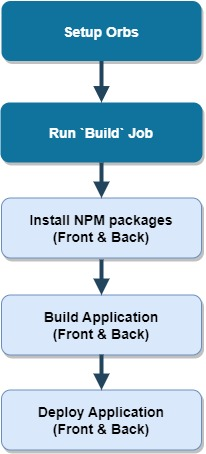

# circleCI pipeline

- Initialize (Node.js, aws cli and eb cli) orbs.
- Run pipeline jobs:
  - install aws-cli.
  - install aws-elastic-beanstalk.
  - install node.js.
  - checkout repo.
  - run Frontend install.
  - run frontend build.
  - run frontend deploy.
  - run Backend install.
  - run backend build.
  - run backend deploy.

## Front-end deploy processes:-

- Upload (Builded) Front-end to s3 bucket using `aws s3 cp` command.

## Back-end deploy processes:-

- Upload (Builded) Backend-end to AWS eb using `eb deploy` command.
- Setup env variables for AWS using `eb setenv` command.

## Diagram

